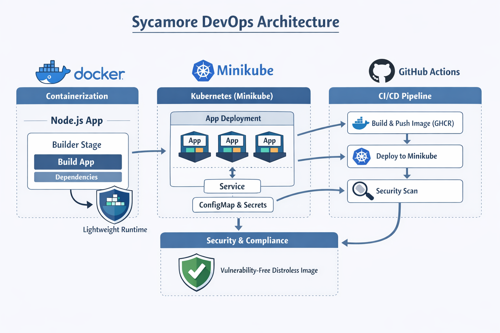

# sycamore-devops

# Archtectural Struture 

**Containization**: Docker

 - The project uses Docker to containerize the Node.js application.
 - The Dockerfile is designed for a multi-stage build:
	 - Builder stage installs dependencies and builds the app.
	 - Final stage is optimized (you could switch to a Distroless base to reduce attack surface and image size).

Containerization ensures environment consistency across dev, test, and Minikube clusters.

**Orchestrartion**: Minikube(k8s)

 - The `k8s/` folder contains manifests to deploy the app on Minikube.
 - Minikube was used to allows local testing of Kubernetes deployments before production.

**CI/CD**: Github Action

 - These workflows likely handle:
	 - Building Docker images.
	 - Running security scans (Trivy).
	 - Pushing images to GHCR (GitHub Container Registry).
	 - Deploying to Minikube for testing.

**Security & Comliance**: Trivy scans

 - Trivy scans show remaining Debian and OpenSSL vulnerabilities.